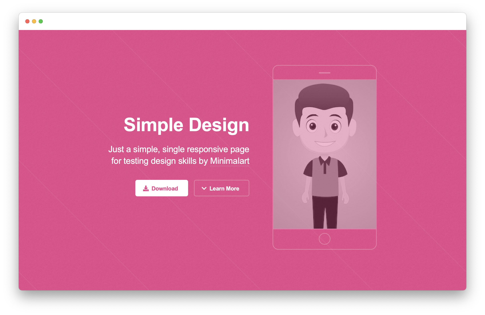
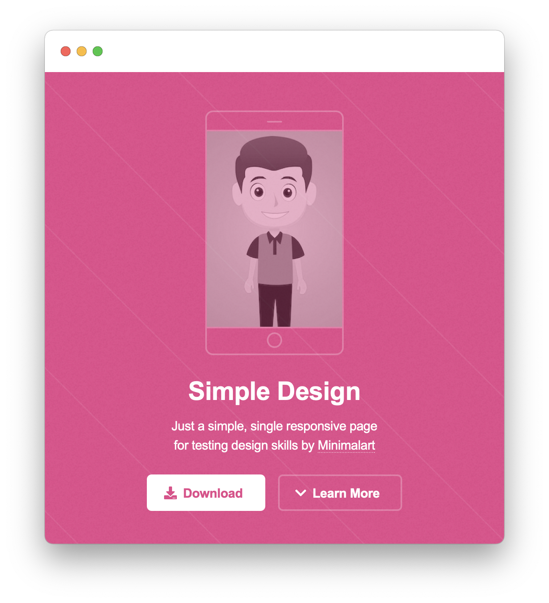

# HTML & CSS Coding Test

### Desktop Reference

### Mobile Reference

### Elements
- Background color: `#e6468b`
- Background pattern: `assets/pattern.svg`
- Mobile picture: `assets/boy.jpg`
### Requirements
- Design in HTML and CSS only, without any framework
- Use Flexbox or CSS Grid for aligning elements
- Mobile frame: design using CSS only
- Icons: use an icon font (not provided)

Thank you for your time!
